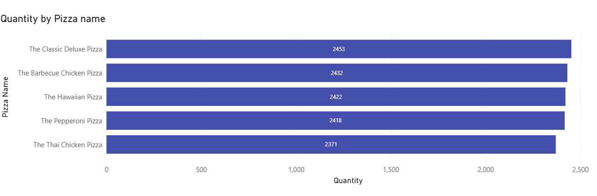
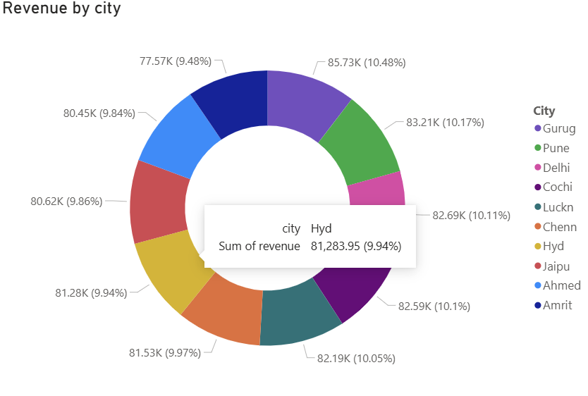
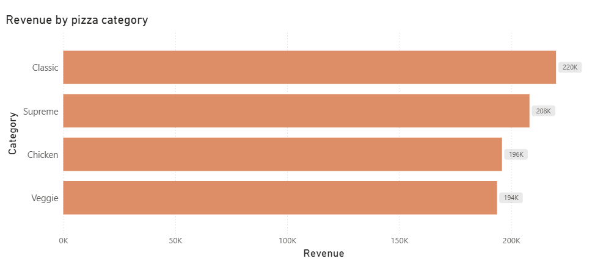
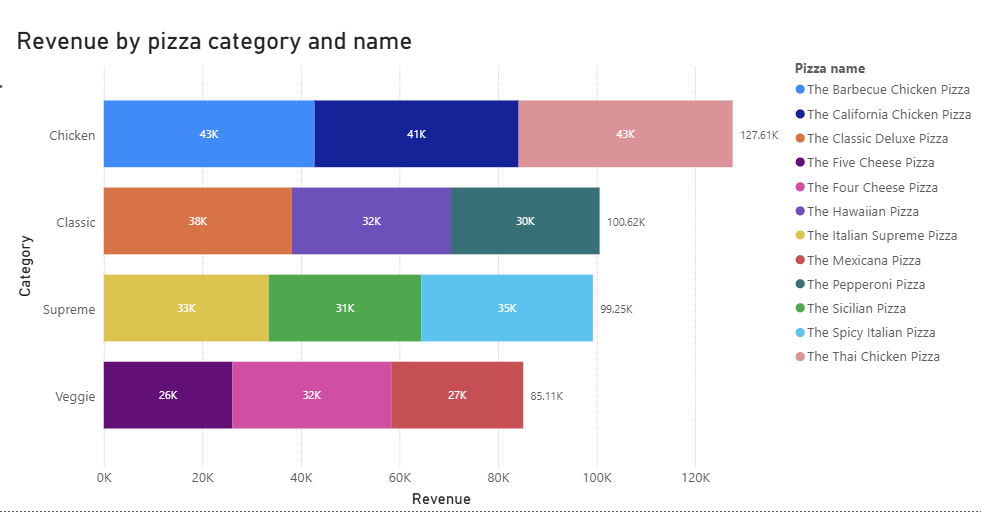
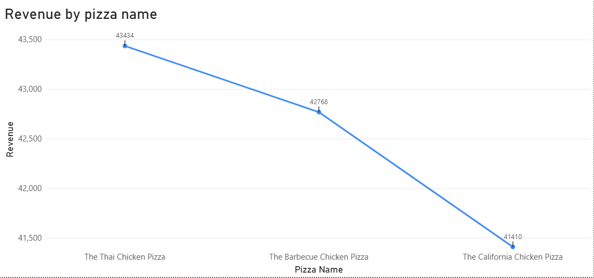
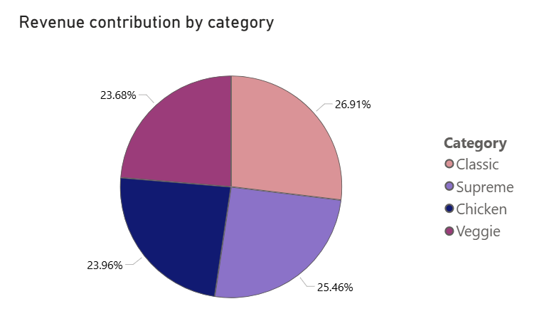
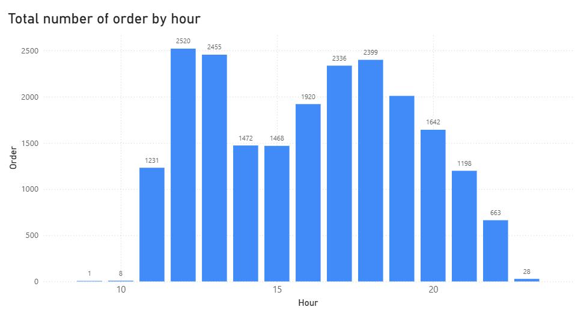

# SQL-PowerBI Sales Analysis

This project analyzes **Pizza sales data** using **MySQL** for querying and **Microsoft Power BI** for interactive visualization.  
The objective is to identify **sales trends**, **top-performing pizzas**, **revenue contribution by category**, and **customer ordering patterns**.

---

## Dataset Description

The dataset contains the following tables:

| Table | Description |
|-------|-------------|
| `orders` | Contains order ID, order date, and order time |
| `order_details` | Contains quantity of pizzas ordered for each order |
| `pizzas` | Contains pizza ID, pizza size, and price |
| `pizza_types` | Contains pizza name, category, and ingredients |
| `customers` | Contains customer ID and location details such as city |

---

## Tools & Technologies

- **SQL** – Data querying (MySQL)  
- **Data Visualization** – Microsoft Power BI  

---

## Key Insights

### Total Quantity by Pizza Name
- **Chart Type:** Bar Chart  
- **Insight:** Highlights the most frequently ordered pizzas. Top pizzas dominate total order quantity, indicating strong customer preference. These items should be prioritized in **promotions** and **inventory planning**.  

---

### Revenue by City
- **Chart Type:** Donut Chart  
- **Insight:** Revenue distribution across cities shows which location generates the largest share of sales. Cities with lower contributions may offer opportunities for **expansion** or **targeted marketing strategies**.  

---

### Revenue by Pizza Category
- **Chart Type:** Bar Chart  
- **Insight:** Compares revenue across pizza categories (Classic, Supreme, Veggie, Chicken). Highest-revenue categories represent the most profitable segments, helping the business focus on **popular categories**.  

---

### Revenue by Pizza Category and Name
- **Chart Type:** Stacked Bar Chart  
- **Insight:** Shows top-performing pizzas within each category. Helps identify which pizzas drive revenue in each category and optimize **menu offerings**.  

---

### Revenue by Pizza Name
- **Chart Type:** Line Chart  
- **Insight:** Highlights the top 3 pizzas generating the highest revenue. A small number of pizzas contribute a significant portion of total revenue, demonstrating key revenue drivers.  

---

### Revenue Percentage by Category
- **Chart Type:** Pie Chart  
- **Insight:** Displays the percentage contribution of each pizza category to total revenue. Provides understanding of **market demand** and **category performance**.  

---

### Total Orders by Month
- **Chart Type:** Line Chart  
- **Insight:** Shows monthly order trends and identifies **seasonal patterns**. Higher order months may reflect seasonal promotions or increased activity.  

---

### Total Orders by Hour
- **Chart Type:** Bar Chart  
- **Insight:** Reveals peak ordering hours. Higher volume during evening hours suggests **dinner time is the busiest**, helping optimize staffing and delivery operations.  

