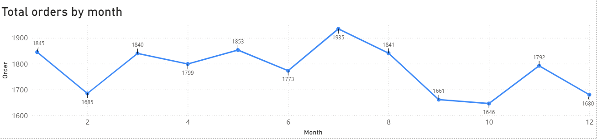

# sql-powerbi-sales-analysis
This project analyzes Pizza sales data using MySQL for querying and Microsoft Power BI for interactive visualization.
The objective is to identify sales trends, top-performing pizzas, revenue contribution by category, and customer ordering patterns.

**Dataset Description**

The dataset contains four tables:

Table	          Description
orders	        Contains order date and time
order_details	  Quantity of pizzas ordered
pizzas	        Pizza size and price
pizza_types	    Pizza name and category

**Tools & Technologies**

SQL – Data querying (MySQL)
Data Visualization – Microsoft Power BI

### Key Insights

**Total Quantity by Pizza Name**  
Chart Type: Bar Chart  
Insight: This chart highlights the most frequently ordered pizzas. The top pizzas dominate total order quantity, indicating strong customer preference for a few specific pizza types. These items contribute significantly to overall sales volume and should be prioritized in promotions and inventory planning.

**Revenue by City**  
Chart Type: Pie Chart  
Insight: Revenue distribution across cities shows which location generates the largest share of pizza sales. The leading city represents the strongest market for the business, while cities with lower contributions may offer opportunities for expansion or targeted marketing strategies.

**Revenue by Pizza Category**  
Chart Type: Bar Chart  
Insight: This visualization compares revenue across pizza categories such as Classic, Supreme, Veggie, and Chicken. The highest-revenue category represents the most profitable product segment, helping the business focus on popular categories when planning menus or promotions.

**Revenue by Pizza Category And Name**  
Chart Type: Stacked Bar Chart  
Insight: Insight: This chart shows top-performing pizzas within each category. It helps identify which individual pizzas drive revenue in each category, allowing the business to focus on high-performing products and optimize menu offerings.

**Revenue by Pizza Name**  
Chart Type: Line Chart  
Insight: This visualization highlights the top 3 pizzas generating the highest revenue. A small number of pizzas contribute a significant portion of total revenue, demonstrating that certain menu items are key drivers of business profitability.

**Revenue Percentage by Category**  
Chart Type: Donut Chart  
Insight: This chart displays the percentage contribution of each pizza category to total revenue. It provides a clear understanding of how sales are distributed among categories and which categories have the strongest market demand.

**Total Order by Month**  
Chart Type: Line Chart  
Insight: This chart shows monthly order trends, helping identify seasonal patterns in customer demand. Months with higher orders may reflect increased customer activity or seasonal promotions.

**Total order by hour**  
Chart Type: Bar Chart  
Insight: This chart reveals peak ordering hours during the day. Higher order volumes during evening hours suggest that dinner time is the most active period for pizza sales, which can help optimize staffing and delivery operations.

